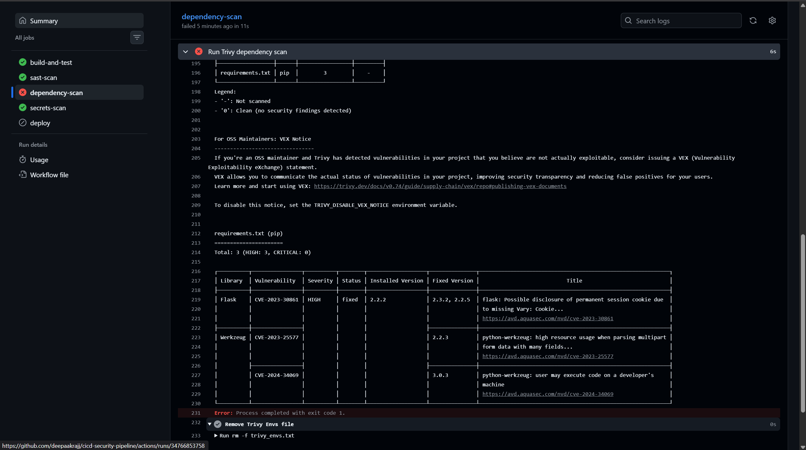
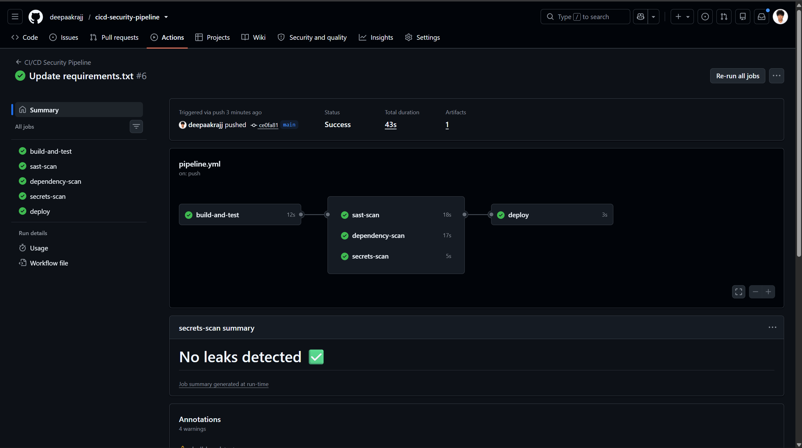

# CI/CD Security Pipeline

A DevSecOps pipeline that automatically scans every code push for three categories of risk — code-level vulnerabilities, vulnerable dependencies, and leaked secrets — and blocks deployment if anything critical is found.

## Why this exists

Manual security review doesn't scale with the pace of modern software delivery. The industry answer is "shift-left security": build automated security checks directly into the CI/CD pipeline so every code change is checked before it can ship, with no dependence on a human remembering to run a scan.

This project implements that pattern end to end on a small Flask API, using GitHub Actions.

## Architecture

```
Push to GitHub
      │
      ▼
Build & test (pytest)
      │
      ├──► SAST scan (Semgrep) ───────┐
      ├──► Dependency scan (Trivy) ───┼──► Any critical finding? ──► Yes: build fails, deploy blocked
      └──► Secrets scan (Gitleaks) ───┘                          └──► No: deploy
```

Each scan runs in parallel after the build/test stage passes. Deployment only runs if all three scans pass — this is the actual enforcement mechanism, not just logging.

## Tool choices and why

- **Semgrep** for SAST — free tier covers Python rule sets well, fast enough to run on every push without slowing the pipeline down, and easy to extend with custom rules later.
- **Trivy** for dependency scanning — open source, made by Aqua Security (used in production by real companies), checks against actively maintained vulnerability databases, and doubles as a container image scanner if this project grows to include Docker.
- **Gitleaks** for secrets scanning — purpose-built for exactly this job, low false-positive rate out of the box compared to writing custom regex secret-detection myself.

## A real problem I hit

I deliberately pinned an old Flask version (`2.2.2`) in `requirements.txt` so the dependency scanner would have something real to catch. When I ran the test suite locally, it failed immediately — not from a security issue, but because that Flask version depends on an older Werkzeug API (`url_quote`) that was removed in the Werkzeug version installed by default. The app literally couldn't start.

This is a good example of why dependency pinning matters for reasons beyond security: an outdated pin doesn't just carry known vulnerabilities, it can break compatibility with everything else in the stack. Fix was pinning `Werkzeug==2.2.2` alongside it so the versions match what Flask 2.2.2 actually expects. Flask itself stays outdated on purpose — that's the intentional vulnerability the dependency scan is meant to catch.

## Project structure

```
.
├── .github/workflows/pipeline.yml   # the pipeline itself
├── app/main.py                      # small Flask to-do API (the target being protected)
├── tests/test_main.py               # unit tests run before any security scan
└── requirements.txt                 # dependencies, including one intentionally outdated
```

## Vulnerability found and fixed

This is the pipeline actually doing its job — not just theory.

**Before fix:** the dependency scan (Trivy) caught 3 real, publicly tracked vulnerabilities in the pinned Flask/Werkzeug versions and blocked the build:

| Library | CVE | Severity | Issue |
|---|---|---|---|
| Flask 2.2.2 | CVE-2023-30861 | HIGH | Possible disclosure of permanent session cookie due to missing Vary: Cookie header |
| Werkzeug | CVE-2023-25577 | HIGH | High resource usage when parsing multipart form data with many fields |
| Werkzeug | CVE-2024-34069 | HIGH | User may execute code on a developer's machine |



**Fix:** bumped `requirements.txt` to `Flask==3.0.3` and `Werkzeug==3.0.3`, both of which resolve all three CVEs. Confirmed the app and test suite still work unchanged with the patched versions before pushing.

**After fix:** all five pipeline stages pass, including the previously-blocked dependency scan, and deploy runs.



This is the enforcement mechanism working as designed: a real vulnerability was introduced, automatically caught before deployment, and the pipeline stayed red until it was actually fixed — not just logged and ignored.

---

## Running locally

```
pip install -r requirements.txt
pytest tests/
python app/main.py
```

## Status

Full pipeline verified end to end on GitHub Actions: build/test, all three security scans, and deploy all passing. The dependency scan already proved itself by catching and blocking a real set of CVEs before the fix above.
